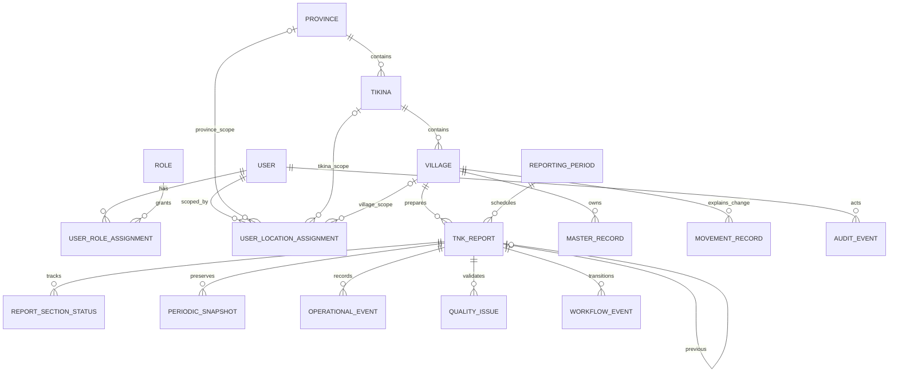
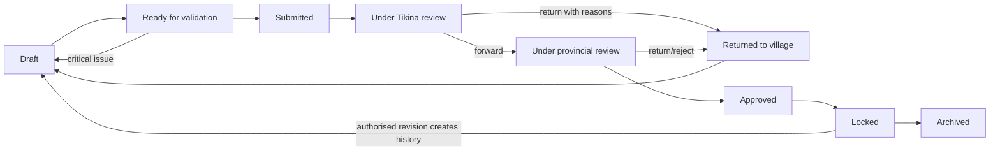

# TNK Insight architecture baseline

## Repository and application structure

The monorepo has `backend/` (Django, templates, static/media roots, tests and split requirements), `docker/`, `docs/`, and a documentation-only `mobile/`. The backend is split by bounded context: Phase 1 activates `accounts`, `locations`, `audit`, and `core`; later phases add `reporting`, `governance`, `households`, `population`, `infrastructure`, `water`, `sanitation`, `energy`, `health`, `disability`, `agriculture`, `economy`, `projects`, `resilience`, `culture`, `workflow`, `documents`, `data_quality`, and `analytics`. Large apps use model packages, services for commands, and selectors for reads.

## MVP and future-mobile boundaries

The website MVP includes secured master data, quarterly reports and independent sections, historical snapshots/movements, validation, review/approval/locking, dashboards, audited exports and printable outputs. It excludes mobile code, offline sync, notifications, ML, public portals, payments, identity integration, and external government APIs. A later mobile client will consume versioned REST services; UUIDs, UTC timestamps, version counters, idempotency and conflict policy will be specified before that phase.

## Relationship summary

Province contains Tikina; Tikina contains Villages. Users receive many Roles and many assignments at exactly one location level per assignment. Villages own master/movement records and one TNKReport per ReportingPeriod. A report links its prior approved report, owns section states, operational events, snapshots, evidence, quality issues, reviews and workflow transitions. Measurements reference source, method, unit, verification and confidence lookups. Audit events identify actor and affected UUID without becoming editable domain state.

## Role and location-access matrix

| Role | Scope | Prepare/edit | Review/approve | Sensitive access |
|---|---|---:|---:|---|
| System Administrator | National | Administration | Emergency administration | Explicitly authorised |
| Provincial Administrator | Province | Reference/users | No final approval by default | Provincial operational need |
| Roko Tui | Province | Comment | Provincial approve/lock | Authorised provincial view |
| Roko Veivuke | Assigned Tikina | Comment | Review/forward | Assigned operational view |
| Mata ni Tikina | Tikina | No village authorship | Review/return/forward | Assigned review need |
| Turaga ni Koro | Village | Full authorised sections | Submit | Own-village need |
| Village Data Assistant | Village | Draft assistance | No | Minimum necessary |
| Village Nurse | Assigned village/health | Health section | Health verification | Restricted health only |
| Project Officer | Assigned locations/projects | Project section | Project verification | Project-only |
| Read-only Analyst | Assigned aggregate scope | No | No | Aggregates only |
| Auditor | Assigned audit scope | No | No operational decisions | Audit records; justified detail |

Every view, selector, export and file download applies server-side scope; navigation visibility is cosmetic only.

## Report workflow

## Data classification matrix

| Class | Examples | Change rule | Time relationship |
|---|---|---|---|
| Reference | units, hazards, age groups, source types | Controlled administration | Effective-dated where needed |
| Master | village profile, households, assets, projects | Update only on real change | Current plus history |
| Movement | births, deaths, moves, appointments, repairs | Append; never erase explanation | Event date |
| Operational | visits, meetings, training, incidents | Append within report | Reporting period/event date |
| Snapshot | population, housing, health, balances | Immutable after approval | One measured state per period/grain |

## Confidentiality matrix

| Level | Typical data | Default audience | Export rule |
|---|---|---|---|
| Public | Published aggregates | Approved public channels (future) | Only approved publication |
| Internal | Administrative summaries | Authenticated assigned staff | Scoped and audited |
| Confidential | Named people, contacts, finance | Need-to-know roles/location | Exclude from ordinary analytics |
| Highly restricted | Health, disability, safeguarding/evidence | Explicit section permission | No bulk export by default |

Access is deny-by-default, attachments are served through authorised views, logs avoid sensitive payloads, and export actions are audited.

## Data-quality framework

Quality rules are versioned and produce issues with severity (`info`, `warning`, `error`, `critical`), affected field/record, message, resolution and waiver provenance. Dimensions are completeness, validity, consistency, verification, timeliness and evidence. Checks include required/null semantics, ranges, cross-field totals, cross-section reconciliation, quarter-to-quarter variance, duplicate grain, chronology, source confidence, and evidence requirements. Zero remains a confirmed value; unanswered is NULL; `unknown` and `not_applicable` are explicit states. Critical unresolved issues block submission. Scores retain their component numerators, denominators, rule version and calculation timestamp so results are explainable and reproducible.

## Assumptions requiring confirmation

- English is initially complete; authorised iTaukei translations will be supplied and reviewed separately.
- Fiji administrative codes and official village lists will be supplied by the responsible ministry; no unrelated project data is imported.
- One assignment targets exactly one Province, Tikina or Village; multiple rows express multiple scopes.
- Roko Tui is the default final approver, with separation-of-duties overrides configured later.
- Highly restricted record and attachment retention periods require a formal government schedule.
- Production hosting, domain, mail relay, backup region and identity-provider policy remain to be confirmed.

## Risks and mitigations

| Risk | Mitigation |
|---|---|
| Scope breadth | Phase gates, acceptance tests, bounded contexts |
| Poor historical comparability | Immutable snapshots, movements, formula/rule versions |
| Unauthorised disclosure | Object scope, section permissions, protected files, audited exports |
| Weak connectivity | Small independent forms now; API/offline architecture later |
| Translation ambiguity | Domain glossary and human-reviewed message catalogues |
| Data entry fatigue | Carry-forward comparison and explicit unchanged confirmation |
| Approval tampering | Transactional workflow events, lock rules, revision lineage |
| PostgreSQL/SQLite drift | PostgreSQL CI/integration suite in later deployment phase |
