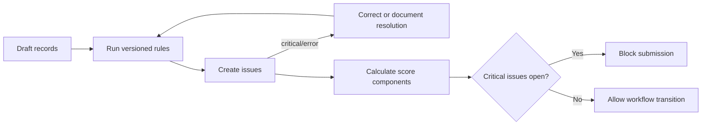

# Data quality

Validation rules create explainable issues with severity, section, field, current/previous values, resolution provenance, and timestamps. Unresolved critical issues block submission. Stored scores use completeness 30%, consistency 25%, verification 20%, timeliness 15%, and evidence 10%. Zero is a confirmed value; NULL is unanswered; unknown and not-applicable remain explicit domain states.

