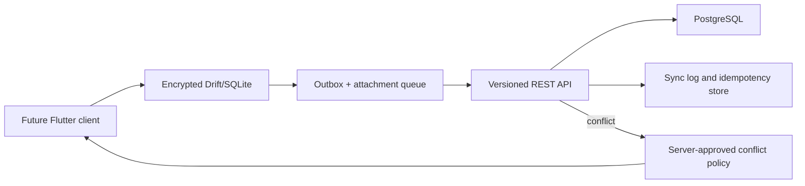

# Future mobile architecture (no mobile code in MVP)

A later Flutter application should use encrypted local storage, secure token storage, batch synchronization, idempotency keys, partial-success results, retry with exponential backoff, durable sync logs and resumable attachment queues. Locked server records are read-only. Conflicts compare record versions and require explicit resolution for sensitive records. Mobile development remains deferred.
