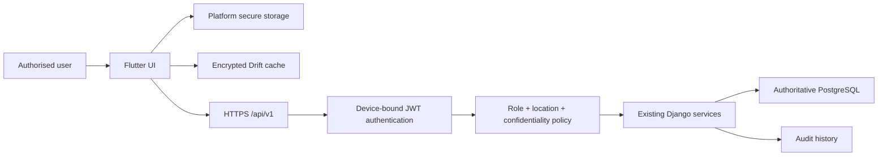

# Mobile security model

Server controls combine authenticated active-device identity, active role, assigned Province/Tikina/Village, section access and confidentiality clearance. Mobile navigation is never an authorization control. Protected evidence remains behind authorized Django views and is not served by Nginx.

The client uses SQLite3 Multiple Ciphers for encrypted Drift storage. A random 256-bit database key is created once and held through platform secure storage backed by Android Keystore/iOS Keychain. JWTs and the installation identifier also use platform secure storage, while passwords are never persisted. Certificate-valid HTTPS, session timeout, safe logging and encrypted attachment queues remain mandatory. Passwords, tokens, keys, health details, financial payloads and evidence content must not be logged. Production URLs and secrets must not be embedded throughout source code.

Every cached or locally-created database record includes the owning user UUID. Queries in later repositories must always apply that scope so a subsequent user on a shared device cannot access another user's cache. PostgreSQL remains authoritative; the encrypted database is only an offline cache and work queue.

Android cloud backup and device-to-device transfer exclude all application files,
databases and preferences. Staging and production activities apply
`FLAG_SECURE`, preventing ordinary screenshots and recent-app thumbnails;
development remains capturable for testing. The main Android manifest denies
cleartext traffic, while the development-only manifest permits local HTTP.

iOS stores credentials in Keychain and the local payload remains encrypted by
the application, but the release must still verify device backup exclusion and
file-protection classes on a signed physical-device build. Screenshot blocking
is not globally enabled on iOS because the platform has no equivalent public
application-wide guarantee; operational policy and sensitive-screen review are
required before production rollout.

