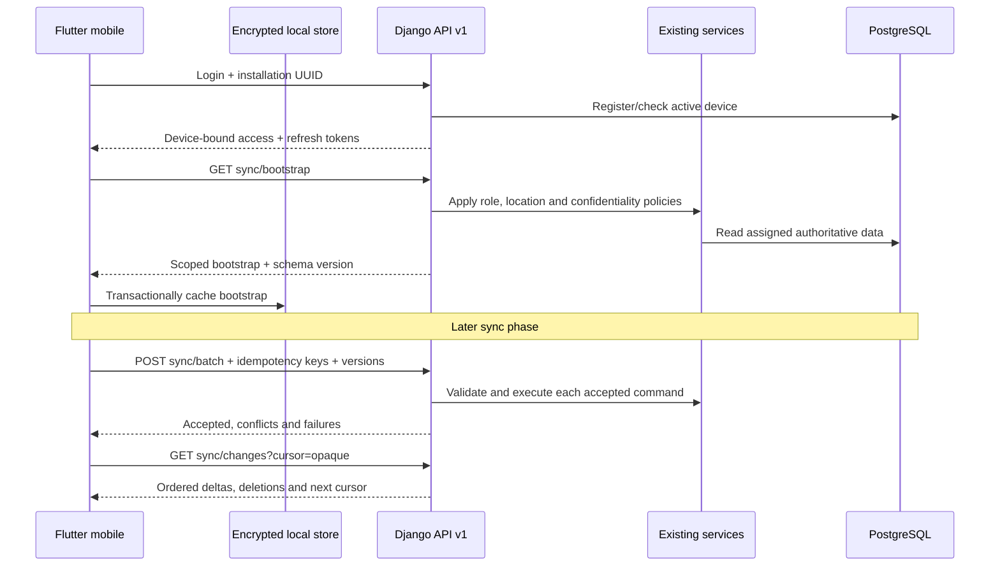

# Mobile sync protocol

Change downloads use a signed, opaque cursor with a fixed scan cutoff and page offset. The client follows `has_more` until the final cursor is received, preventing records created during a long scan or records beyond the 1,000-item page limit from being skipped.

Binary evidence is never placed in `sync/batch`; see `mobile-evidence.md` for its authenticated, idempotent multipart flow.

Phase 7 implements authenticated delta download and partial-success batch upload for report entry records.

`GET /api/v1/sync/changes/` returns scoped authoritative entries, deletion notices, server time and a signed opaque cursor. Clients must never manufacture or edit cursors. `POST /api/v1/sync/batch/` accepts at most 100 entry commands and returns independent `accepted`, `conflicts`, and `failed` collections. Reference data, permissions and workflow state are always server-authoritative. Attachments use a separate upload flow rather than JSON batches.

Each upload command contains a stable local UUID, report/section/entry identity, operation, values, expected record version and UUID idempotency key. A repeated key with the same request returns the recorded result without creating a duplicate. Reusing a key for different content fails. Idempotency records expire after 30 days.

Updates compare `expected_record_version` to the current server record. Mismatches return the safe current server representation and never overwrite it. Invalid records do not roll back valid records in the same batch. The server still applies report ownership, role, location, confidentiality, editable-state and Django form/service validation to every item.

Flutter persists the idempotency key before transmission, applies accepted items transactionally, stores 409-equivalent item conflicts in the encrypted conflict table, retains network failures for retry, and marks permanent validation/permission failures without endless automatic retries. Local sync logs contain counts and safe error text only.

