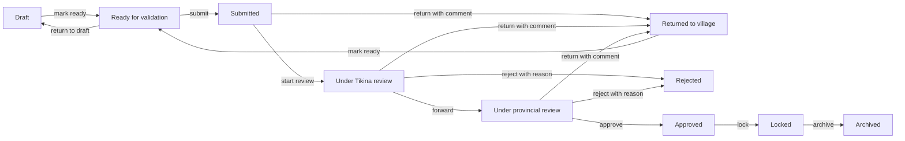

# Authoritative TNK report workflow

This is the single approved workflow implemented by `apps.workflow.transitions`. Report status must be changed through that service; forms, admin fields, URL parameters, and direct model saves are not workflow mechanisms.

## Transition matrix

| Service action | Source | Target | Allowed roles | Required controls |
|---|---|---|---|---|
| `mark_ready` | draft, returned | ready for validation | Turaga ni Koro, Village Data Assistant | assigned location; acknowledged final declaration; validation; no unresolved critical issue |
| `reopen_draft` | ready for validation | draft | Turaga ni Koro, Village Data Assistant | assigned location; declaration is invalidated |
| `submit` | ready for validation | submitted | Turaga ni Koro | assigned location; declaration rechecked; validation; no unresolved critical issue |
| `start_tikina_review` | submitted | under Tikina review | Mata ni Tikina, Roko Veivuke | assigned location |
| `return` | submitted, under Tikina review | returned to village | Mata ni Tikina, Roko Veivuke | assigned location; required correction comment; declaration is invalidated |
| `return` | under provincial review | returned to village | Roko Tui | assigned location; required correction comment; declaration is invalidated |
| `forward` | under Tikina review | under provincial review | Mata ni Tikina, Roko Veivuke | assigned location |
| `reject` | under Tikina review | rejected | Mata ni Tikina, Roko Veivuke | assigned location; required reason |
| `reject` | under provincial review | rejected | Roko Tui | assigned location; required reason |
| `approve` | under provincial review | approved | Roko Tui | assigned location; current validation; acknowledgement; preparer cannot approve own report |
| `lock` | approved | locked | Roko Tui, System Administrator | assigned location; acknowledgement; preparer cannot lock own report |
| `archive` | locked | archived | Roko Tui, System Administrator | assigned location; reason; acknowledgement; preparer cannot archive own report |

Village Nurse, Provincial Administrator, Analyst, and Auditor roles have no report-status transition. System Administrator is limited to lock/archive emergency administration; a Django superuser bypasses the role lookup but not source-state, required comment/declaration/acknowledgement, or separation-of-duties checks.

## Behavioural rules

- `draft` and `returned_to_village` are the only editable report states.
- Marking ready freezes data entry. An author may deliberately return the report to draft, which invalidates the declaration.
- Returning a submitted/reviewed report also invalidates the declaration so corrected data must be declared again.
- Data-quality validation runs at mark-ready, submit, and approve. Warnings do not block; unresolved critical issues do.
- All commands lock the report row inside a transaction, check the current database state, increment `record_version`, create an immutable `ApprovalAction`, and create an `AuditEvent`.
- Return, rejection, and archival reasons are retained in the immutable action.
- Approval, locking, and archival require digital acknowledgement.
- Rejected and archived are terminal in Phase A. A later approved amendment design must not reopen or overwrite the original report.
- Hidden buttons provide no authority. The same rules apply to direct service calls and direct POST requests.
